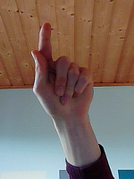
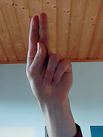
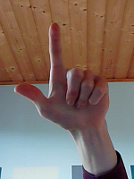
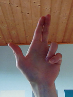
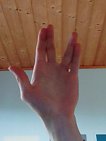
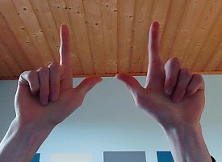
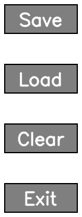
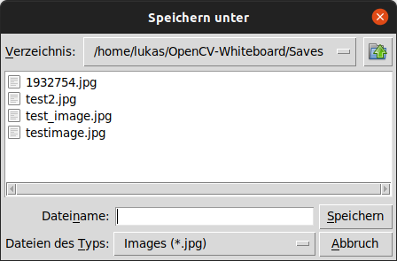
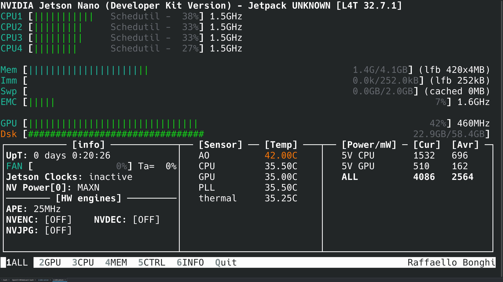

# OpenCV-Whiteboard
## Autoren
Lukas Haupt
 
Stefan Weisbeck

## Gliederung
- Idee und Lösungskomponenten
- Gestenerkennung
  - Gründe für eigenen Ansatz
  - Rotation
- Grundfunktionen
  - Beispiele
- Features
  - Button-Erweiterung
  - Backup
  - Zoom
- Kompatibilität mit dem nVIDIA Jetson Nano
  - Probleme mit Installation von Packages
  - Probleme mit CSI-Kamera

## Idee und Lösungskomponenten
Der Ansatz für das Projekt ergab sich daraus, ein modernes Whiteboard, für den täglichen Einsatz, mithilfe grundlegender Funktionen nachzubilden. Im Folgenden wird der generelle Ablauf des Programmes beschrieben:

> Mithilfe einer Webcam werden die Hände des Benutzers betrachtet. Werden nun die Hände in bestimmte Positionen gebracht, so führt das Programm eine jeweils zugehörige Funktion aus. Zu den grundlegenden Funktionen gehören Zeichnen, Radieren, Farbwechsel, sowie das Speichern, Laden und Löschen von Skizzen. Das Whiteboard soll so konzipiert sein, dass alle Funktionen ausschließlich durch bestimmte Gesten ausgeführt werden.

Die Darstellung der Programmes erfolgt über OpenCV. Aufgrund der Schnittstelle ist es möglich, Inhalte innerhalb benutzerdefinierter Fenster darzustellen, sowie  diese gemäß verschiedener Funktionen und Attributen zu bearbeiten.

Für das Tracking der Finger/Hände wird Mediapipe benutzt. Mediapipe bietet plattformübergreifende Machine Learning Lösungen für dynamische Eingaben. Als "ready-to-use"-Lösung wird hierfür das "Mediapipe Hands"-Framework verwendet. Die Analyse eines Frames gibt dabei ein Objekt zurück, in dem die 21 normierten Koordinaten der jeweils erkannten Hände liegen. Diese Koordinaten befinden sich im dreidimensionalen Raum.

## Gestenerkennung
Die Gesternerkennung erfolgt durch einen alternativen, eigenen Ansatz. Nach der Berechnung der Koordinaten für die Indices des Handmodells durch Mediapipe, werden diese in einer separaten Methode auf diverse Anordnungen überprüft (Beispiel: Ist eine x- oder/und y-Koordinate größer/kleiner als eine andere?). Hier wird absichtlich die z-Koordinate ausgeschlossen. Kalkulationen dieser Art befinden sich dementsprechend im zweidimensionalen Raum. Werden nun alle Kriterien einer Geste erfüllt, so wird diese zurückgegeben.

Theoretisch wäre es möglich gewesen, die Erkennung der Handgesten mithilfe von TensorFlow zu implementieren. TensorFlow ist eine open-source Bibliothek für Machine Learning und Deep Learning und besitzt einen besonderen Fokus auf Deep Neural Networks.

Eine Implementierung mit TensorFlow wäre simpel: Nachdem ein Bild der Kamera durch Mediapipe analysiert wird, gibt man das daraus resultierende Objekt an TensorFlow weiter. Mit den zur Verfügung stehenden Methoden und Modellen wird eine Geste durch Wahrscheinlichkeitsberechnungen bestimmt. Diese wird im weiteren Programmablauf verarbeitet.

Aus Gründen der Flexibilität wurde gegen TensorFlow entschieden, wie im Folgenden erläutert wird.

### Gründe für eigenen Ansatz
1. Mit unserer Vorstellung, dass die Funktionen des Whiteboards bestimmte Handgesten verwenden, war eine Einbindung bereits vorgefertigter Modelle für TensorFlow ausgeschlossen. Diese bestanden entweder aus einer Vielzahl von Gesten, die sich semantisch nicht in unser Projekt einordnen ließen oder aufgrund der Größe des Modells nicht ausreichend genug waren.

2. Das Trainieren von eigenen, spezifischen Gesten bezüglich eines Modells wäre für unsere Anwendung zu aufwendig gewesen, da die Größe des Projektes den Zeitraum der Projektphase stark beschränkt hat. Des Weiteren wurden sowohl das Einlesen in die Thematik als auch eventuell damit verbundene Problembehandlungen für das Erstellen eines solchen Modells berücksichtigt.

3. Unsere Kalkulation für die Gestenerkennung is einfach zu implementieren, die sie auf grundlegenden Operationen und Vergleichen beruht.

### Rotation

Die Implementation der Gestenerkennung basiert auf der Annahme, dass die Hand sich in einer senkrechten Position befindet. Dies ist aber ergonomisch ungünstig und erschwert die Bedienung enorm. Da die Gestenerkennung ansonsten gut funktioniert wurde beschlossen, die erkannten Landmarken der Hand zu rotieren. Auf diese Weise blieb die Gestenerkennung als solche von den Änderungen unberührt.

Da die Position im Raum für die Gestenerkennung irrelevant ist, konnte auf eine Translation zu einem Rotationszentrum verzichtet werden. Es blieb als einzige Transformation die Rotation. Aufgrund der geringen Anzahl von 42 (zum Implementationszeitpunkt 21) 2D-Punkten und der Notwendigkeit von nur einer Transformation wurde beschlossen, diese auf der CPU auszuführen.

Als Vergleichsachse wurde die Strecke zwischen der Handwurzel (Punkt 0) und den Zeigefingeransatzes (Punkt 5) gewählt. Da der Zeigefinger bei allen Gesten zum Einsatz kommt wird hier eine besonders unverfälschte Positionierung erwartet.

Die Berechnung der des Schnittwinkels zur Vertikalen erfolgt nach der Formel

Da der Schnittwinkel zur Vertikalen ermittelt wird, fallen einige Teile der Berechnung weg, sodass das Programm nicht die vollständige Berechnung ausführt.
Nachdem der Schnittwinkel ermittel wurde wird noch überprüft, ob eine Rotation von über 90° und in welche Richtung diese durchgeführt wird. Da die gewählte Vergleichsachse nicht vertikal ist wird um einen Versatz von 0,5 Rad rotiert. Je nach Rotationsrichtung und Hand wird der Versatz addiert oder Subtrahiert.

## Grundfunktionen
Die dargestellten Abbildungen (siehe Figure 2-7) repräsentieren die verschiedenen Gesten.
Es sollte im Optimalfall darauf geachtet werden, einen möglichst freien, eintönigen (weißen) Hintergrund zu benutzen, da andernfalls Berechnungen von Mediapipe zu verfälschten Ergebnissen führen können. Aufgrund dessen erweist sich die Benutzung gelegentlich als äußerst schwierig.
Probleme die hier angesprochen werden sind in der Praxis häufig eine falsche Erkennung einer Geste oder einer Hand.

Generell wird das Whiteboard bezüglich der Manipulation eines Bildes über Gesten gesteuert. Funktionen, die sich aufgrund der Rotation verändern, betreffen das Speichern, Laden, sowie das Löschen des Whiteboard-Screens.

### Beispiele

## Features

### Button-Erweiterung
Der Aufbau eines Buttons besteht aus einem zweidimensionalen Array, welches zuzüglich Hintergrundfarbe und Titel mittels OpenCV erstellt wird. Die Buttons werden mit bestimmten Abständen dynamisch in das Hauptfenster eingebunden. Die Veränderung des Designs und die Funktionalität erfolgen über sogenannte "Mouse-Events". Die Hintergrundfarbe wird überschrieben, sobald der Mauszeiger über dem Button liegt. Klickt man anschließend auf den Button, so wird abhängig vom Titel des Buttons die jeweilige Funktion ausgeführt.

Die oben aufgelisteten Funktionen (Speichern, Laden und Löschen sowie das Schließen des Programmes) werden über diese Button-Funktionalität realisiert. Bewegt der Benutzer den Mauszeiger über einen beliebigen Button, so wird dieser farblich verändert.

Wird die Speicher-/Lade-Funktion ausgeführt, so öffnet sich ein externes Fenster (siehe Figure 9), in dem der Benutzer das Bild mit einem benutzerdefinierten Namen abspeichern oder ein unabhängiges Bild laden kann. Ein weiterer Button existiert für das Löschen des Bildes. Hier wird das Whiteboard mit einem neuen, leeren Array initialisiert. Zusätzlich lässt sich die Anwendung auch über einen separaten Button beenden. Dabei werden alle "OpenCV"-abhägingen Variablen freigegeben.

### Backup
Als weiteres Feature verfügt die Applikation über einen Backup-Mechanismus, der im Falle eines Absturzes des Programmes, den bisherigen Stand des Whiteboard-Screens sichert.
Erfahrungen zufolge tritt dies beispielsweise dann auf, wenn die Kamera unerwartet abstürzt. Erreicht wird diese Funktionalität durch eine Ausführung der Speicherfunktion mit statischem Dateinamen.

### Zoom
Das Zoomen erfolgt nach einem speziellen Ablauf. Zuerst wird eine Sicherung vom aktuellen Whiteboard-Screen erstellt. Anschließend wird mit der Zoom-Geste kein Zoom-Faktor berechnet, mit dem der neue Screen (ein Teilabschnitt des Original-Screens) berechnet wird. Dieser Teilabschnitt wieder wieder auf die Original-Auflösung erweitert.

Wird nun das skalierte Whiteboard bearbeitet und zurückgezoomt, so überschreibt dieser Teilabschnitt den äquivalenten Bereich auf dem zuvor gesicherten Originalbild.
Da die Skalierung zu einer Unschärfe des Bildes bei dem Zurückbilden auf das Originalbild führt, werden nachträglich bestimmte Filter zur Wiederherstellung der Schärfe des Bildes angewendet.

## Kompatibilität mit dem nVIDIA Jetson Nano

Die Entwicklung der Anwendung erfolgte wegen Problemen mit dem Mediapipe Paket zunähst auf einem x86_64 PC entwickelt. Daher war zu nicht von Anfang an klar, ob die Anwendung auf einen nVIDIA Jetson Nano portierbar war.

Die größten Probleme bereitete das Mediapipe Paket. Dieses ist als fertiges Paket weder bei den Systempaketquellen noch bei Pip verfügbar und. Mediapipe kann auch nicht selbst compiliert werden, da eine Projektabhängigkeit vom Bazel Pakets, welches für ARM nicht verfügbar ist, nicht erfüllt werden kann. Als funktionierende Lösung wurden dann ein fertiges Wheel-Paket für Pip eingesetzt. Für OpenCV wurde des Installationsskript von Mediapipe verwendet, welches automatisch die korrekte Version von OpenCV installiert. Das neuste Wheel-Paket liegt allerdings nur als ältere Version 0.8.5 vor und nicht in der auf der PC Entwicklungsumgebung verwendeten Version 0.8.9.1. Dadurch konnten einige der genutzten Funktionen in der neueren Version nicht verwendet werden.

Da der Zweihand-Modus in der Version 0.8.5 noch nicht funktioniert, musste auf die Zoomfunktion, welche zwei Händen benötigt, verzichtet werden. Auch wurde deutlich, dass die Handerkennung in der älteren Version leicht unzuverlässiger ist. Dennoch kann die Anwendung den Zweck eines Whiteboards zuverlässig erfüllen. Auch das Programm selbst musste an den Jetson Nano angepasst werden. Aufgrund der geringen Auflösung des Bildschirms musste das UI, welches auf Auflösungen ab 1080p ausgelegt worden war, an die geringere Auflösung von 1024x600 angepasst werden.

Der Versuch die zum Jetson Nano gehörende CSI-Kamera zu verwenden konnte nicht erfolgreich abgeschlossen werden. Die dazu notwendige Pakete für Python3 konnten nicht installiert werden wodurch ein ansteuern der CSI-Kamera mit der auf Python3 aufbauenden Whiteboard Anwendung nicht möglich war. Der Einsatz mithilfe einer USB Webcam ist allerdings wie am PC ohne Einschränkungen möglich.

Abgesehen von den Einschränkungen in der Hardware und der Zoomfunktion ergibt sich auf dem Jeson Nano ein gutes Benutzererlebnis. Die geringe Auflösung der Kamera (640x480) und der Leinwand (1024x600) ermöglicht auch auf den Jetson Nano eine flüssiges und responsives Zeichnen.

Die moderate Auslastung des Jetson Nano lässt vermuten, das auch mit einer höheren Leinwandauflösung eine akzeptable Leistungsfähigkeit der Anwendung erreicht werden kann.
